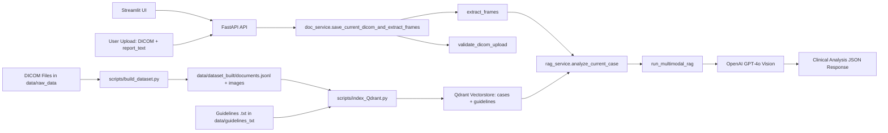
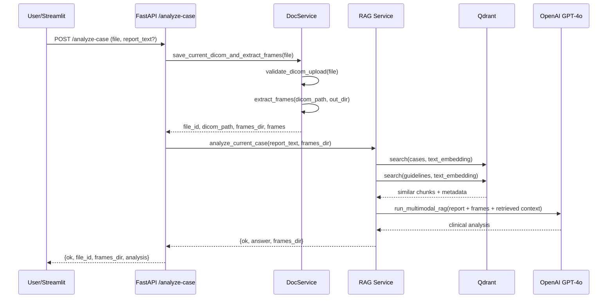

# RAG System for Healthcare


Multimodal RAG (Retrieval-Augmented Generation) system for clinical decision support in cardiology. It combines DICOM echocardiography image analysis, semantic retrieval of similar cases and guidelines, and AI-assisted diagnostic responses.

## ✨ Highlights

- **Multimodal RAG**: Combines text retrieval + GPT-4o Vision for image-based clinical analysis.
- **Privacy by Design**: Full GDPR/HIPAA compliant anonymization pipeline with automated verification.
- **Production-grade Architecture**: FastAPI + Docker + CI/CD + security scanning + structured logging.
- **MLOps Pipeline**: Experiment tracking (MLflow), data versioning (DVC), evaluation metrics.
- **Comprehensive Testing**: Integration tests, contract tests, anonymization tests, and API test suite.

> **📌 API Note**: The system is currently optimized for multimodal case analysis through `/analyze-case`. The generic `/chat` endpoint is temporarily disabled and will return in future releases.

## ⚠️ Privacy & Anonymization

**All patient data has been fully anonymized** in compliance with GDPR and HIPAA regulations.

- ✅ All DICOM metadata is anonymized (names, dates, IDs removed)
- ✅ Only non-identifiable clinical and technical data is preserved
- ✅ Safe for publication in a public repository

📖 See [ANONYMIZATION.md](ANONYMIZATION.md) for details.

## 🚀 Quick Start (Manual - Recommended)

```bash
# 1. Activate virtual environment
source .venv/bin/activate

# 2. Set OpenAI API key
export OPENAI_API_KEY="sk-..."

# 3. Start the system (auto dataset build + auto-indexing + Streamlit)
make start
```

The system starts **automatically**:
- ✅ FastAPI backend: http://localhost:8000
- ✅ Streamlit UI: http://localhost:8501
- ✅ Vectorstore with auto-indexing

**Access**:
- **Streamlit UI**: http://localhost:8501 (🔬 Analyze, 📤 Upload, 📋 Manage)
- **API Docs**: http://localhost:8000/docs

📖 Full guide: [QUICKSTART.md](QUICKSTART.md)

## 🐳 Quick Start (Docker)

```bash
# Start with Docker
./start-docker.sh
# or
make docker-up
```

```bash
# Stop everything
make docker-down
```

📖 **Full API guide**: see [QUICKSTART.md](QUICKSTART.md)  
📖 **Docker guide**: see [DOCKER.md](DOCKER.md)

## Architecture

### System Flow (Mermaid)



### `/analyze-case` Sequence (Mermaid)



### Base Dataset (Auto-generated)
- **26 cardiology cases** (DICOM files) → 286 indexed documents
  - Normal (10), normal variants (6), pathological cases (10)
  - 14 different diagnostic categories
- **Frame extraction**: ~10 frames/case + metadata (view, fps, motion features)
- **Auto-indexing**: Qdrant vectorstore automatically populated at startup

### Pipeline
1. **Build Dataset**: `scripts/build_dataset.py` processes DICOM files → `documents.jsonl`
2. **Vectorstore Manager**: auto-indexing with SentenceTransformer (`all-MiniLM-L6-v2`)
3. **RAG Service**: semantic retrieval + prompt augmentation
4. **FastAPI Backend**: REST API for analysis, DICOM upload, and document management

## Useful Commands

```bash
# Rebuild dataset (after adding DICOM files in data/raw_data/)
./rebuild_dataset.sh

# Test API endpoint - Analyze case
curl -X POST http://localhost:8000/analyze-case   -F "file=@data/raw_data/Normal/IM-0001-0032.dcm"   -F "report_text=Optional clinical report"

# View all available endpoints
# Visit http://localhost:8000/docs
```

## 🧠 Technical Decisions

| Decision | Choice | Why |
|---|---|---|
| Vector DB | Qdrant (in-memory) | Fast, supports named vectors, easy Docker setup |
| Embedding | all-MiniLM-L6-v2 | Good balance quality/speed, runs locally, no API needed |
| LLM | GPT-4o | Strong multimodal capability for image+text clinical analysis |
| Anonymization | Hash-based case IDs + DICOM tag stripping | GDPR/HIPAA compliant, deterministic |

📚 Decision history and rationale: [docs/adr/README.md](docs/adr/README.md)

## Technical Details

- **Embeddings**: SentenceTransformer `all-MiniLM-L6-v2` (384 dim, local, no API)
- **Vectorstore**: Qdrant in-memory (26 cases + 13 guidelines)
- **LLM**: OpenAI GPT-4o with vision (multimodal)
- **DICOM**: pydicom + PIL for frame extraction + metadata
- **Backend**: FastAPI + Pydantic + CORS

### UI Preview

Add a fresh Streamlit screenshot or GIF captured from the local app (`http://localhost:8501`) and place it in `docs/images/`.

Suggested filename: `docs/images/streamlit-ui.gif`

Markdown snippet to use once added: ``

## Structure

```
├── api/main.py                    # FastAPI app
├── src/vectorstore_manager.py     # Singleton Qdrant + auto-indexing
├── scripts/
│   ├── build_dataset.py           # DICOM → documents.jsonl
│   └── multimodal_rag_openai.py   # Multimodal RAG pipeline
├── data/
│   ├── raw_data/                  # Original DICOM files (26 files, 14 categories)
│   ├── dataset_built/             # Auto-generated (documents.jsonl + images/)
│   └── guidelines_txt/            # Guidelines (13 .txt files)
├── start.sh                       # Full startup
└── rebuild_dataset.sh             # Rebuild dataset
```

## Requirements

- Python 3.10+
- OpenAI API key
- ~2GB RAM (embeddings + in-memory vectorstore)

### Dependency pinning (transitive only)

For reproducible installs, use the lock file that pins transitive dependencies:

- Install with the lock file: `pip install -r requirements.lock`
- Update the lock file from direct requirements: `pip-compile requirements.in -o requirements.lock`

## Privacy Notice

⚠️ **Original DICOM files are NOT included** in this repository.

Only the anonymized derived dataset is provided. All patient-identifiable information has been removed in compliance with privacy regulations.

To verify anonymization:
```bash
python3 scripts/verify_anonymization.py
```
